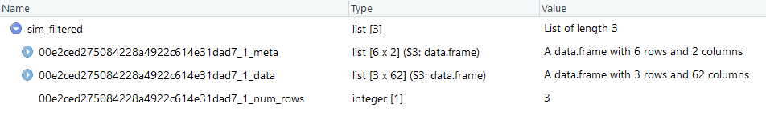

```{r setup, include=FALSE}
knitr::opts_chunk$set(
  results = 'asis',
  echo = FALSE,
  warning = FALSE,
  message = FALSE,
  fig.align = 'center'
)

#Load libraries
library(tidyverse)
library(gapminder)
library(gganimate)
library(kableExtra)
```


# Introduction

I am a software engineer working on Agriculture Production SIMulator (APSIM) software.
APSIM is a process based model aimed at simulating crop and animal growth at the paddock scale.
It outputs customisable reporting data in space delimited text files at daily, month, yearly or crop event time scales. 
APSIM is used to create simulations that mimic the real world to generate what if scenarios for farming management.
Output is compared against real world experiments in order to improve the process based science in the model.


# My Synthesis Project

Clusters are currently been used more and more to generate massively large data sets of output files.
It is not uncommon to run millions of simulations on clusters with millions of corresponding output files.
These large numbers of output files pose a serious problem in analysis of the data.
Standard approach when analysing data is to first plot or visualise the data and then once an understanding of your data is obtained then filter out only the data of interest. 
This approach can no longer be maintained as the sheer quantity of data causes problems for visualisation tools.

My approach is to tip the standard approach on its head, and filter first using customisable sensibility filters applied to each output file and then visualise the data that either passes or fails these tests. 
In order to speed up the filter process this is done in parallel using the same sort of clustering technology that originally ran the simulations.


# My Digital Toolbox

The CSIRO High Performance computing cluster using Slurm array jobs is used to run a customised R script in parallel on every output file in the dataset.
Standard R plotting packages are used to plot the data eg. ggplot.

I did not know R before data school or how to run jobs on the CSIRO High Performance Computer cluster.

## Favourite tool

The Git Bash command line has been a surprise favourite of mine. 
Lets you combine the power of command line Git with the standard tools of ssh for logging in and running jobs on the cluster.


# My time went ...

Setting up the Slurm array jobs. Automating this part is proving most difficult.

# Next steps

Create an R package that allows users can easily install. 
This will allow users from R studio running on their desktop to run the filtering on the cluster and then plot and visualise the results in R studio on their desktop. 

Possible idea to test would be to visualise the data spatially on a map of Australia using leaflet or as a shiny app that uses javascript to select points on the map and display more detailed information about the point selected.


<br/>
<br/>
<br/>

<!-- **Tables** -->

<!-- ```{r mytable, out.width='100%', echo = T} -->
<!-- knitr::kable(head(gapminder, n = 5), format = "html") %>%  -->
<!--   kable_styling("striped") -->
<!-- ``` -->

# Sample Data

**Single Simulation Data (this x 600000)**


**Meta Data (head)**


**Single Ouput File (out)**


**Filtered Output File (with Provenance maintained)**



<!--{width=180px} -->

<!-- **Plots from R** -->
<!-- ```{r standard-plot, out.width='100%', fig.align='center', fig.height= 3, fig.width=8} -->
<!-- gapminder %>%  -->
<!--   filter(year == 1987) %>%  -->
<!--   ggplot(aes(x = gdpPercap, y = lifeExp, colour = continent, size = pop)) + -->
<!--   geom_point() + -->
<!--   scale_x_log10(labels = function(b) format(b, scientific = F)) + -->
<!--   scale_size(trans = "sqrt", guide = "none") + -->
<!--   scale_color_brewer(palette = "Set1") + -->
<!--   theme_linedraw() + -->
<!--   theme(legend.position = "bottom") -->
<!-- ``` -->


<!-- **Animations just to show off a digital poster** -->
<!-- ```{r anim, fig.align='center', cache=TRUE, out.width="100%"} -->
<!-- # cache=TRUE because the animations take a while to render -->
<!-- # so we don't want to render them unless we change the code in here -->

<!-- anim <- gapminder %>%  -->
<!--   ggplot(aes(x = gdpPercap, y = lifeExp, colour = continent, size = pop)) + -->
<!--   geom_point() + -->
<!--   scale_x_log10(labels = function(b) format(b, scientific = F)) + -->
<!--   scale_size(trans = "sqrt", guide = "none") + -->
<!--   scale_color_brewer(palette = "Set1") + -->
<!--   theme_linedraw() + -->
<!--   theme(legend.position = "bottom") + -->
<!--   transition_time(year) + -->
<!--   ease_aes("cubic-in-out") -->


<!-- animate(anim, nframes = 200, fps=20, detail = 2, start_pause = 20, end_pause=20,  -->
<!--         width=1200, height=800, res = 200 -->
<!-- ) -->
<!-- ``` -->

<!-- # My Data School Experience -->

<!-- This poster is mostly about your synthesis project. However we would also like to hear about other -->
<!-- parts of your Data School experience. What aspects of the program did you really enjoy? How have you -->
<!-- been applying the skills you have learned in your daily work? Have you been able to transfer this  -->
<!-- knowledge to your team members? Concrete examples demonstrating this would be useful here -->
<!-- (meetings/talks/collaborations/new roles). Any descriptions of the personal impact the program has  -->
<!-- had are welcome here as well -->

<!-- This section will also be shifted outside the two column format (to the bottom -- the focus of this -->
<!-- poster should be on your achievements in your project!). As with the Introduction, don't change the -->
<!-- name of this section otherwiseit will not be able to be moved. -->

